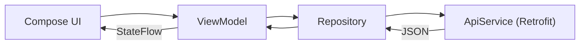

# Membuat App News

<div class="text-center">
  
  <p class="mt-2 text-sm text-neutral-600 italic">Geser untuk melihat gambar lainnya</p>
</div>

---

## Arsitektur (MVVM)

Data mengalir satu arah: UI memanggil ViewModel, ViewModel meminta data ke Repository, Repository mengambilnya dari API lewat Retrofit. Respons JSON kembali ke atas dan ditampilkan oleh Compose sebagai *state*.



Struktur paket yang akan kita buat:

```text
com.app.news
├── data
│   ├── api          → ApiService.kt, RetrofitInstance.kt
│   ├── model        → News.kt
│   └── repository   → NewsRepository.kt
├── ui
│   ├── screen       → HomeScreen.kt, DetailScreen.kt
│   └── component    → NewsCard.kt
├── viewmodel        → NewsViewModel.kt
└── MainActivity.kt
```

## Persiapan

- **Android Studio** dengan template *Empty Activity (Compose)*, package `com.app.news`.
- **API key** gratis dari [newsapi.org/register](https://newsapi.org/register).


Paket **Developer** NewsAPI **gratis tetapi hanya untuk development/testing** — tidak bisa dipakai di aplikasi produksi. Field `content` juga **dipotong** (sekitar 200 karakter), jadi untuk membaca artikel penuh kita arahkan ke `url` di browser.


## Langkah 1 — Tambahkan Dependency

Buka `build.gradle.kts (:app)` lalu tambahkan di blok `dependencies`:

```kotlin
// Retrofit + Gson + logging
implementation("com.squareup.retrofit2:retrofit:2.11.0")
implementation("com.squareup.retrofit2:converter-gson:2.11.0")
implementation("com.squareup.okhttp3:logging-interceptor:4.12.0")

// Coroutines
implementation("org.jetbrains.kotlinx:kotlinx-coroutines-android:1.9.0")

// ViewModel + StateFlow di Compose
implementation("androidx.lifecycle:lifecycle-viewmodel-compose:2.8.7")
implementation("androidx.lifecycle:lifecycle-runtime-compose:2.8.7")

// Navigation Compose
implementation("androidx.navigation:navigation-compose:2.8.5")

// Coil 3 (memuat gambar) — dua baris ini wajib
implementation("io.coil-kt.coil3:coil-compose:3.4.0")
implementation("io.coil-kt.coil3:coil-network-okhttp:3.4.0")
```


Coil 3 butuh **dua** baris. Tanpa `coil-network-okhttp`, gambar tidak akan muncul — ini penyebab paling umum gambar kosong.


## Langkah 2 — Izin Internet & API Key

Tambahkan izin di `AndroidManifest.xml` (di dalam `<manifest>`):

```xml
<uses-permission android:name="android.permission.INTERNET" />
```

Simpan API key di `local.properties` (file ini tidak ikut ke Git):

```properties
NEWS_API_KEY=tempel_api_key_kamu_di_sini
```

Lalu di `build.gradle.kts (:app)`, baca key tersebut agar bisa diakses lewat `BuildConfig`:

```kotlin
// di paling atas file
import java.util.Properties
val localProps = Properties().apply {
    val f = rootProject.file("local.properties")
    if (f.exists()) f.inputStream().use { load(it) }
}

android {
    defaultConfig {
        buildConfigField("String", "NEWS_API_KEY", "\"${localProps.getProperty("NEWS_API_KEY", "")}\"")
    }
    buildFeatures {
        compose = true
        buildConfig = true   // wajib agar BuildConfig.NEWS_API_KEY tersedia
    }
}
```


Setelah mengaktifkan `buildConfig = true`, lakukan **Build → Rebuild Project** supaya `BuildConfig` dibuat ulang.


## Langkah 3 — Data Model

`data/model/News.kt` — memetakan bentuk JSON ke kelas Kotlin. Nama properti harus sama dengan kunci JSON agar Gson mengisinya otomatis.

```kotlin
package com.app.news.data.model

data class NewsResponse(
    val status: String,
    val totalResults: Int,
    val articles: List<Article>
)

data class Article(
    val source: Source?,
    val author: String?,
    val title: String,
    val description: String?,
    val url: String,
    val urlToImage: String?,
    val publishedAt: String?,
    val content: String?
)

data class Source(val id: String?, val name: String?)
```

## Langkah 4 — API Service

`data/api/ApiService.kt` — setiap fungsi mewakili satu endpoint. Kata kunci `suspend` membuatnya berjalan di coroutine.

```kotlin
package com.app.news.data.api

import com.app.news.BuildConfig
import com.app.news.data.model.NewsResponse
import retrofit2.http.GET
import retrofit2.http.Query

interface ApiService {

    @GET("v2/top-headlines")
    suspend fun getTopHeadlines(
        @Query("country") country: String = "us",
        @Query("apiKey") apiKey: String = BuildConfig.NEWS_API_KEY
    ): NewsResponse

    @GET("v2/everything")
    suspend fun searchNews(
        @Query("q") query: String,
        @Query("apiKey") apiKey: String = BuildConfig.NEWS_API_KEY
    ): NewsResponse
}
```

## Langkah 5 — Retrofit Instance

`data/api/RetrofitInstance.kt` — satu objek Retrofit yang dibagikan.

```kotlin
package com.app.news.data.api

import okhttp3.OkHttpClient
import okhttp3.logging.HttpLoggingInterceptor
import retrofit2.Retrofit
import retrofit2.converter.gson.GsonConverterFactory

object RetrofitInstance {

    private const val BASE_URL = "https://newsapi.org/"

    private val client by lazy {
        OkHttpClient.Builder()
            .addInterceptor(HttpLoggingInterceptor().apply {
                level = HttpLoggingInterceptor.Level.BODY
            })
            .build()
    }

    val api: ApiService by lazy {
        Retrofit.Builder()
            .baseUrl(BASE_URL)
            .client(client)
            .addConverterFactory(GsonConverterFactory.create()) // JSON → objek Kotlin
            .build()
            .create(ApiService::class.java)
    }
}
```


Retrofit modern (≥ 2.6) sudah mendukung fungsi `suspend` secara bawaan — **tidak perlu** `CoroutineCallAdapterFactory`. Cukup `GsonConverterFactory`.


## Langkah 6 — Repository

`data/repository/NewsRepository.kt` — satu pintu untuk mengambil data.

```kotlin
package com.app.news.data.repository

import com.app.news.data.api.ApiService
import com.app.news.data.api.RetrofitInstance
import com.app.news.data.model.NewsResponse

class NewsRepository(
    private val api: ApiService = RetrofitInstance.api
) {
    suspend fun getTopHeadlines(country: String = "us"): NewsResponse =
        api.getTopHeadlines(country = country)

    suspend fun searchNews(query: String): NewsResponse =
        api.searchNews(query = query)
}
```

## Langkah 7 — UI State & ViewModel

Kita modelkan tiga kondisi layar (Loading / Success / Error) dengan *sealed class*, lalu ViewModel menjalankan pemanggilan jaringan di `viewModelScope` dan mengeksposnya sebagai `StateFlow`.

```kotlin
package com.app.news.viewmodel

import androidx.lifecycle.ViewModel
import androidx.lifecycle.viewModelScope
import com.app.news.data.model.Article
import com.app.news.data.repository.NewsRepository
import kotlinx.coroutines.flow.MutableStateFlow
import kotlinx.coroutines.flow.StateFlow
import kotlinx.coroutines.flow.asStateFlow
import kotlinx.coroutines.launch

sealed class NewsState {
    data object Loading : NewsState()
    data class Success(val articles: List<Article>) : NewsState()
    data class Error(val message: String) : NewsState()
}

class NewsViewModel(
    private val repository: NewsRepository = NewsRepository()
) : ViewModel() {

    private val _state = MutableStateFlow<NewsState>(NewsState.Loading)
    val state: StateFlow<NewsState> = _state.asStateFlow()

    // artikel yang dipilih untuk ditampilkan di halaman detail
    var selectedArticle: Article? = null
        private set

    init { loadHeadlines() }

    fun loadHeadlines() {
        viewModelScope.launch {
            _state.value = NewsState.Loading
            try {
                _state.value = NewsState.Success(repository.getTopHeadlines().articles)
            } catch (e: Exception) {
                _state.value = NewsState.Error(e.message ?: "Terjadi kesalahan")
            }
        }
    }

    fun selectArticle(article: Article) { selectedArticle = article }
}
```


Fitur **Search** dan **Pull to Refresh** mengikuti pola yang sama: tambahkan `StateFlow` baru lalu panggil `repository.searchNews(...)` atau `getTopHeadlines()` lagi di dalam `viewModelScope`.


## Langkah 8 — Tampilan (Compose)

**Komponen kartu berita** — `ui/component/NewsCard.kt`:

```kotlin
@Composable
fun NewsCard(article: Article, onClick: () -> Unit) {
    Card(
        modifier = Modifier
            .fillMaxWidth()
            .clickable { onClick() }
    ) {
        Row(Modifier.padding(12.dp)) {
            AsyncImage(
                model = article.urlToImage,
                contentDescription = null,
                contentScale = ContentScale.Crop,
                modifier = Modifier.size(88.dp).clip(RoundedCornerShape(8.dp))
            )
            Spacer(Modifier.width(12.dp))
            Column {
                Text(article.title, fontWeight = FontWeight.Bold, maxLines = 2)
                Text(article.author ?: "Unknown", style = MaterialTheme.typography.bodySmall)
            }
        }
    }
}
```

**Halaman Home** — `ui/screen/HomeScreen.kt` menampilkan `state` sesuai kondisinya:

```kotlin
@Composable
fun HomeScreen(viewModel: NewsViewModel, onArticleClick: (Article) -> Unit) {
    val state by viewModel.state.collectAsStateWithLifecycle()

    when (val s = state) {
        is NewsState.Loading -> CircularProgressIndicator()
        is NewsState.Error   -> Text("Gagal memuat: ${s.message}")
        is NewsState.Success -> LazyColumn(contentPadding = PaddingValues(16.dp)) {
            items(s.articles) { article ->
                NewsCard(article) { onArticleClick(article) }
                Spacer(Modifier.height(12.dp))
            }
        }
    }
}
```

Halaman **Detail** (`DetailScreen.kt`) membaca `viewModel.selectedArticle` lalu menampilkan gambar, judul, dan isi berita, plus tombol untuk membuka artikel asli di browser (`Intent.ACTION_VIEW`).

## Langkah 9 — Navigasi & MainActivity

Satu `NewsViewModel` dibagikan ke semua layar lewat Navigation Compose.

```kotlin
@Composable
fun NewsApp() {
    val navController = rememberNavController()
    val viewModel: NewsViewModel = viewModel()

    NavHost(navController, startDestination = "home") {
        composable("home") {
            HomeScreen(viewModel) { article ->
                viewModel.selectArticle(article)
                navController.navigate("detail")
            }
        }
        composable("detail") {
            DetailScreen(viewModel) { navController.popBackStack() }
        }
    }
}
```

Panggil `NewsApp()` di dalam `setContent { NewsAppTheme { NewsApp() } }` pada `MainActivity`.

## Menjalankan Aplikasi

Jalankan di emulator/perangkat yang **terhubung internet**. Alurnya: muncul *loading* → daftar berita tampil → ketuk salah satu kartu untuk membuka detail. Pantau **Logcat** (filter `OkHttp`) untuk melihat request/response aslinya.